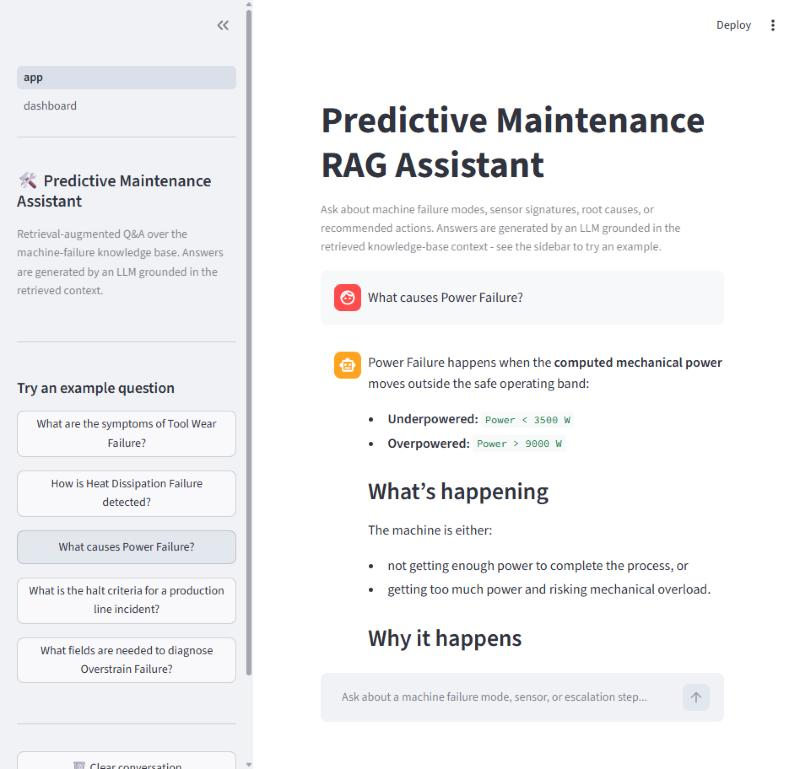
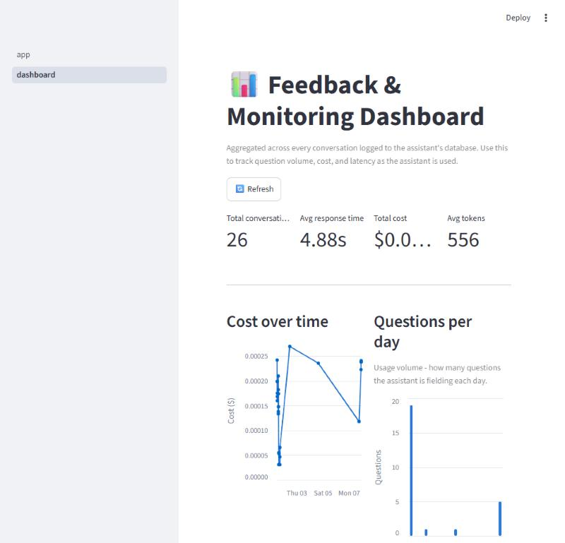

# Predictive Maintenance RAG Assistant

DataTalks LLM Zoomcamp 2026 Capstone Project

A retrieval-augmented Q&A assistant for industrial predictive maintenance. Machine
operators, equipment engineers, and technicians can ask plain-English questions
about equipment failure modes and get an answer grounded in a curated
maintenance knowledge base, generated by an LLM rather than just returning a
raw FAQ match.



## Problem description

Diagnosing an equipment failure quickly usually means digging through FAQ
documents, SOPs, or tribal knowledge scattered across a maintenance team. This
project turns a structured knowledge base — built around the five failure
modes in the [AI4I 2020 Predictive Maintenance dataset](https://archive.ics.uci.edu/dataset/601/ai4i+2020+predictive+maintenance+dataset)
(Tool Wear Failure, Heat Dissipation Failure, Power Failure, Overstrain
Failure, and Random Failure) — into a conversational assistant. Instead of
searching through documents by hand, a user can ask something like *"What
reading range on tool wear usually points to a tool wear failure, and is it a
hard cutoff?"* and get a structured answer (what's happening, why, and the
recommended action) synthesized from the relevant knowledge-base entries.

## Architecture

```
User question
      │
      ▼
Retrieval  (src/search.py)       TF-IDF vectorization + cosine similarity
      │                          over question/answer/section/failure_mode/
      │                          process_control text, top-5 matches
      ▼
Prompt assembly  (src/rag_helper.py)   Retrieved entries formatted into context,
      │                                 injected into a fixed prompt template
      ▼
Generation  (OpenAI Responses API, gpt-5.4-mini)
      │
      ▼
Answer + usage metrics (src/metrics.py)   cost, tokens, response time
      │
      ▼
Streamlit chat UI  (app/app.py)
```

An LLM-as-judge (`src/judge.py`) scores every generated answer's relevance,
and `app/pages/dashboard.py` / `src/database.py` provide a Postgres-backed
conversation log and monitoring dashboard (see
[Monitoring](#monitoring-dashboard) below).

## Project structure

```
data/
  knowledge_base.json      The initial knowledge base files (kb_001_twf.md, kb_002_hdf.md, kb_003_pwf.md, kb_004_osf.md, kb_005_rnf.md, kb_006_general_sop.md, and kb_007_sensor_reference.md)
                           were generated with the assistance of Claude AI, based on information from the AI4I 2020 Predictive Maintenance Dataset
                           and relevant research papers cited by or related to the dataset.
                           The build_knowledge_base.py script is then used to process these individual knowledge base files and generate the overall knowledge_base JSON file in an FAQ-style format.
                           The UCI page confirms that the AI4I 2020 dataset includes the five failure modes (TWF, HDF, PWF, OSF, and RNF) and provides the associated introductory paper.
                           71 FAQ-style entries across the 5 failure modes
  ground_truth.csv         355 LLM-generated evaluation questions (5 per entry)
  rag_answer.csv           generated answers, prompt/model Approach A
  rag_answer2.csv          generated answers, prompt/model Approach B
  rag_evaluate1.csv        LLM-judge scores for Approach A
  rag_evaluate2.csv        LLM-judge scores for Approach B

notebook/
  ground_truth_generation.ipynb   builds ground_truth.csv from the knowledge base
  retrieval_evaluation.ipynb      compares lexical vs. vector-based retrieval
  rag_answer_generation.ipynb     generates answers for two prompt/model approaches
  rag_evaluation.ipynb            LLM-as-judge scoring + approach comparison

src/
  ingest.py         loads the knowledge base, builds a lexical search index
  search.py         TF-IDF + cosine-similarity retrieval (used in production)
  rag_helper.py      RAGBase: prompt building + OpenAI call
  metrics.py         RAGWithMetrics: production assistant (usage/cost tracking)
  evaluation.py       RAGWithUsage + shared LLM-call / cost-tracking helpers
  judge.py            LLM-as-judge relevance check used live in the chat app
  assistant.py         wires up the winning prompt/model config for the app
  database.py           Postgres schema + conversation/feedback logging

app/
  app.py                  Streamlit chat interface (main entry point)
  pages/
    dashboard.py          monitoring dashboard (cost, latency, volume) -
                           auto-added as a second page/sidebar link by
                           Streamlit's multipage navigation

docs/
  screenshots/          chat.jpg, dashboard.jpg (used in this README)

Dockerfile            builds the app image (used by docker-compose.yml)
docker-compose.yml     app + Postgres, both started with `docker compose up`
requirements.txt
```

## Evaluation

### Retrieval evaluation

Two retrieval methods were compared against the full 355-question ground
truth set (`notebook/retrieval_evaluation.ipynb`):

| Method | Hit rate | MRR |
|---|---|---|
| Lexical / boosted keyword search | 0.682 | 0.485 |
| TF-IDF + cosine similarity | **0.879** | **0.700** |

TF-IDF cosine-similarity search was adopted for the production assistant
(`src/search.py`, used by `RAGWithMetrics.search`).

### LLM (answer) evaluation

Two end-to-end answer-generation approaches were each run over all 355
ground-truth questions and scored with an LLM-as-judge
(`good`/`bad`, comparing the generated answer against the ground-truth
answer) in `notebook/rag_evaluation.ipynb`:

| Approach | Prompt | Model | LLM-judge "good" rate |
|---|---|---|---|
| A | Structured (what/why/action, cite mechanism) | gpt-5.4-mini | **82.8%** |
| B | Short/concise | gpt-4o-mini | 79.7% |

Approach A scored higher and is the configuration used in production
(`src/assistant.py`, `src/rag_helper.py`).

## Setup

Requires an OpenAI API key. Create a `.env` file in the project root first,
either way you choose to run it below:

```
OPENAI_API_KEY=sk-...
POSTGRES_HOST=localhost
POSTGRES_DB=pm_assistant
POSTGRES_USER=user
POSTGRES_PASSWORD=pswd
```

### Option A: Docker (recommended)

```bash
docker compose up --build -d
```

This builds the app image, starts Postgres, waits for it to be healthy,
initializes the database schema automatically, and starts the Streamlit app
— one command, nothing else to run. Open **http://localhost:8501**.

`docker-compose.yml` runs two services on a shared `monitoring` network:
`postgres` (`postgres:17`, port 5432, with a named `pgdata` volume so data
survives restarts) and `app` (built from the repo's `Dockerfile`, port
8501). The app container talks to Postgres via the `postgres` service name
rather than `localhost` — that override is set directly in
`docker-compose.yml`, so your local `.env`'s `POSTGRES_HOST=localhost` value
(used for Option B below) doesn't need to change.

### Option B: Local Python

Needed if you also want to run the evaluation notebooks (Jupyter isn't
containerized).

```bash
python -m venv .venv
source .venv/bin/activate        # .venv\Scripts\activate on Windows
pip install -r requirements.txt
```

Start just the database with Docker (or point `.env` at your own Postgres
instance), then initialize the schema once and run the app:

```bash
docker compose up -d postgres
python -c "from src.database import create_conversation_db; create_conversation_db()"
streamlit run app/app.py
```

Either way, the monitoring dashboard is a second page inside the same app
(`app/pages/dashboard.py`) — Streamlit's built-in multipage navigation picks
up anything in `app/pages/` automatically, so a "Dashboard" link appears in
the sidebar next to the chat page. There's no separate command to run it.

## Reproducing the evaluation

Run the notebooks in this order from the `notebook/` directory:

1. `ground_truth_generation.ipynb` — generates `data/ground_truth.csv`
2. `retrieval_evaluation.ipynb` — compares retrieval methods
3. `rag_answer_generation.ipynb` — generates `rag_answer.csv` / `rag_answer2.csv`
   for both prompt/model approaches
4. `rag_evaluation.ipynb` — LLM-judges both answer sets and compares them

Each notebook adds the project root to `sys.path` and expects to be run with
its working directory set to `notebook/`.

## Monitoring dashboard



`app/pages/dashboard.py` (reachable via the sidebar link inside the running
app) reads conversation history from Postgres (`src/database.py`) and shows
total conversations, average response time, total cost, average tokens,
question volume per day, a prompt-vs-completion token breakdown, and
cost/latency trends over time.

Every question asked in `app/app.py` is logged to the `conversations` table
(`save_conversation`), along with an automatic LLM-as-judge relevance verdict
and the user's own 👍/👎 feedback (`save_feedback`) — so the dashboard
reflects real usage as soon as the app is used, with no extra setup beyond
the Postgres steps above.

## License

MIT — see [LICENSE](LICENSE).
